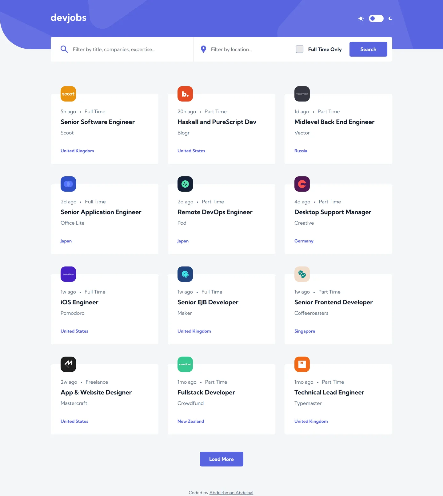

# devjobs

My solution to the [Devjobs web app](https://www.frontendmentor.io/challenges/devjobs-web-app-HuvC_LP4l)
challenge on Frontend Mentor.

- Live: https://devjobs-web-app.abdelrhman-ahmed8881.workers.dev
- Code: https://github.com/MrBlackvanta/devjobs-web-app

## Built with

- Next.js 16 and React 19
- TypeScript
- Tailwind CSS v4
- A .NET API for the data (see `backend/`)

## Author

- [LinkedIn](https://www.linkedin.com/in/abdelrhman-vanta/)
- [UpWork](https://www.upwork.com/freelancers/mrblackvanta)
- [Frontend Mentor](https://www.frontendmentor.io/profile/MrBlackvanta)
